Telechargons le Unity Hub pour pas ce casser la tete sur l install

https://docs.unity.com/en-us/hub


Allons cherchez la version de la formation   
   
https://unity.com/releases/editor/whats-new/6000.3.13f1   


Allons dans install
Et ajoutons avec le manager a droite sur limage:
= Android Build Support
  - OpenJDK
  - Android SDK / NDK


Il nous faut aussi le IL2CPP pour Meta et pour faire des codes utilisants le Job System pour loptimisation


Creeons un project


Il y a des templates de projet configurer pouar la XR ou la VR.


Nous on va partir de rien pour apprendre a setup le projet sans outils en trop.
Avec un URP Render Piple blank project


Cest outils seront installer


On veut pas donner notre code a Unity.
Creeons un projet Local


Unity U/Q:  


Creons un projet sur Github que je vais appeler HelloUnityA4


Allons sauver notre projet avec GitHub... Vu que Unity me laisse pas faire


`2026_06_06_unity_hello_unity_a4`


Bon bah on peu aller creer un jeu en godot pendant que Unity charge:   


Pendant que ca charge on peut aller verifier que votre projet c est bien creer


Vous povuez meme prendre le temps de vous creer un repistory en votre nom pour votre page d acceuile
[](https://github.com/EloiStree
)


Nous voila en Unity3D

Verifions que on a un gitignore


Petit add commit pull push

Verifions que lon voit les extensions de fichier et les fichiers cacher.


`git status`
 pour verifier qu il y bien un git ignore et pas de fichier temporaire
`git add .`


Un petit commit.
`git commit -m "Empty ready project"`

Un petit pull push pour le sauver en ligne.
Si on fait de la merde


Alors vu que Unity n a aps creer un read me en ligne et creer le projet local il faut le push sur le stream our le force push . C est pas necessairement la meilleur maniere.
`Force Push` 


Essayons de retirer les packages qui serve t a rien


Disable AI


Disable Cloth 


Un a un ca fait long allons dans manifest.json


Evidement ca peut etre dangereux de retirer des modules
Mais ai je besoin de ca dans mon projet...  
```
    "com.unity.modules.physics2d": "1.0.0",
    "com.unity.modules.terrain": "1.0.0",
    "com.unity.modules.terrainphysics": "1.0.0",
    "com.unity.modules.wind": "1.0.0",
    "com.unity.ai.navigation": "2.0.12",
```


Un petit Add commit pull push si vous avez pas tous caser


Allons sur l asset store de Unity


Et cherchons le Meta XR SDK
(Ca change toujours de nom tout les ans, taper oculus meta xr)

https://assetstore.unity.com/packages/sdk/meta-xr-sdk-9022845


Ajoutons les packages a notre projet ouvert.


Quand vous fait un tutorial en ligne regarder bien la version utiliser et les numeros d os du quest ( si il est bien ajour)


Clicker installer et aller boire un cafe 😉
Ou faire un jeu sur Scratch   
https://scratch.mit.edu/  


Je vous laisse choisir si vous voulez partager avec Meta


Je vais skip en fermant la fenetre


On peut aller sur le menu mais comme il nous le propose


Avant de fix les problemes, il nous faut installer open xr


Je suppose que oui du coup.


Fixons  ce que Unity XR Plug in nous propose.


Ca ma telecharger une XR Simulator


Mais je l utilise peu a mon niveau.

J ai tendance a creer mes outils hors de la VR et de le tester en VR quand l outil est pret.
Ce qui fait que je peux me passer du simulateur.  


Ok, validateur est bon. Allons faire un add commit pull push.


Allons setup les paramettres du projet


Et validons ce qu il nou reste a valider.


Parlans de cela est pas encore sur Android mais sur Window


Bon.. bah du coup allons mettre notre projet en Android


And Build profiles


Coffee time


Changer pour android peu changer des paremetres.
Refait un tour dans le precedent menu.


Prenons la dernier version de C#


Si vous utilisez des servers externes local ou des AI dans votre jeux: (example LLM Studio of Flask Python)


Si votre application doit aller dans le fichier du Quest pour chercher des images, video ou avoir un dossier dans l racine de la carte sd pour etre plus facilement trouvable par lutilisateur


Be sure to use a unique namepackage for your apk
pay.company.appuniquename.
⚠ ALphaNumericm pas d'espsace ou de character speciaux ⚠


--------

Creeons une scene vide


Puis ajoutons la au prochain build


Retirer la camera et allons dire bonjour au Block de Meta


All the blocks


Ajoutons une camera


Cela nous ajoute les Composants tout chaud .
AJoutons y un sphere dans chaque mains pour les voir avec un ou deux centimetres


On veut faire de la realiter augmenter avec l passthrouhg


On veut voir les manettes


Interagire avec les mains


Si vous fait un jeu VR


C est nouveau pour moi mais vous pouvez ajouter les cameras


On veut voir les mains plus en details


Il y a plein de Blocks qui chaqun necessite 1-5 jours de cours.
On ne les vera donc pas ;)

Mais si vous voulez vous rendre emplyable les connaitres est uen bonne idea.


Bon dans la theory, on pourrait faire play pour jouer a notre jeu.

Mais on a pas installer les applications pour faire de la VR et pas configurer notre casque en Oculus Link.


Pas de message  derreur mais un ecran noir qui bouge pas.

Essayons de builder pour le Quest un APK puis on regardera comment le jouer sur le PC directement.

Je vous invite a ajouter un cube et un sol dans votre scene
Pour voir si votre apk a fonctionner.


----------------------------------

Pour aller plus loin, il faut configurer votre casque en mode developpeurs.
Ce qui est deja faire avec les casques de la formation.
Si c est pas le cas, il faut le faire. 

Checher un video sur Youtube qui vous explique comment faire.
- Creer un compte meta developer
- Ajouter la double authentification
- Ajouter une organisation
- Creer une app
- Aller sur votre telphone
- Pairer le casque a votre compte developpeur
- Aller dans le option
- Toggle developer mode.

En Gros.


Maintenant il faut que votre casque soit autoriser de discuter avec votre oridinateur.

Bancher les casques et essayer d avoir ce menu


Toujours authoriser histoire de pas valider a chaque fois.

Android est un peu debile de ce coter la.
De fois, il faut redermer le casque et brancher debrancher jusqua ce que le message arrive.

Si il arrive pas cest que le casque est developer mais un setting interne a deconner. Faut le desactiver et reactiver comme developer.

Une fois valider 

Buildons notre APK.


Tant que vous avez pas valider le message.
Vous aurez ceci


------------

Bon ja vais preter mon casque a une personn.e
Je dois donc le Factory Reset
https://www.meta.com/en-gb/help/quest/149134797159340/
Power et volume -

De fait repartir pour un cafee a updated a la dernier version


Pendant que cela ce build
on peut aller verifier que c est app sont installer
- Godot Engine
- Open Source
- Open Blocks
- Steam Link
- ALVR
- Virtual desktop💲
- HDMI LINK
- First encounter
- Hello Qyest et Hand**

----------


20 Minutes plus tard


Faut savoir que ILCCP permet de builder moins vite...
Apres la premier fois.

ET a chaque fois que vous reseter certain paramettre de Unity
Cest pour cela que cest mieux d avoir un PC assez puissant qui fait tourner la VR...
Et qui soit pas un laptop.

Les laptops on un carte graphique brider pas suffisante pour la VR meme a 2200 Euro le laptop.
Autant avoir une petit tour a 1200 bien configurer.


----------


If you see that it means that we are good


Choisisez zone stationaire ou configurer le guardian room pour pouvoir bouger dans la piece. ;)


Vous voila heureux proprietaire d un application de realite augmenter en Oculus Quest sous Unity.

Fecilisations.

-


Changer la couleur du cube et rebuilder pour voir.


Normalement du fait d avoir utiliser IL2CPP  
cela ne devrait plus faire 27 minutes mais 1-2 minutes.   


Toke me 4


Manifiique mais c est lourd.
Si comme moi vous n avez pas un PC pour faire tourner la VR.
Alors vous devez travailer par boite a outils.

Creer des outils pour la VR dans des projets Non vr.
Puis les tester une fois que ca vous semble fonctionnel.

Bon ici dans la formation vous avec un PC puissance.
Donc allons voir comment on fait pour jouer a la VR sur votre PC.


-----------------


# Oculus Setup


Allons chercher le software de Meta pour installer sur votre ordinateur Oculus Link
[](https://www.meta.com/be/en/quest/setup/)  
https://www.meta.com/be/en/quest/setup/
  


Note that it is the good time to update your graphic card driver

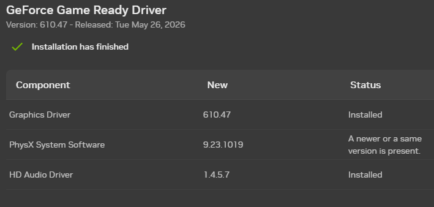


Accepter de vendre votre ame


Choisir le dossier d install


Attendre


More waiting


Si vous voulez vous puvez commancer a installer Steam VR et ALVR pendant ce temps.
https://github.com/alvr-org/ALVR
https://store.steampowered.com/app/250820/SteamVR/


Ok Creer un compte si c est pas deja le cas.
Et connect on nous.

BOn, j ai oublier mon nom de compte et mot de passe donc j ai creer un attendant

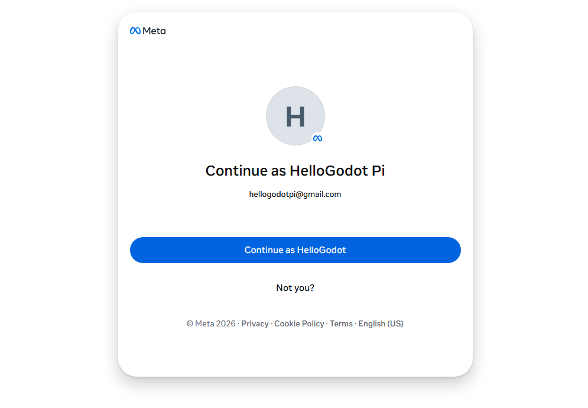


Setup nous propose de configurer notre casque
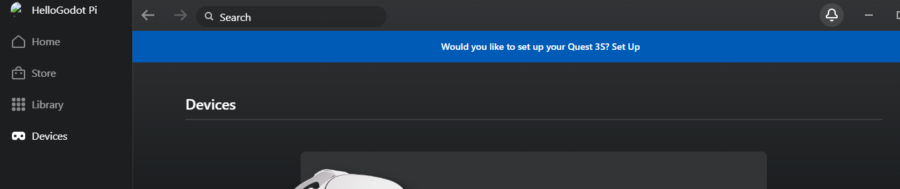

Par cable


Bon... On ferra avec


Allons dans la partie setting developer secion si vous etes devleoppeur


Accepter tout les options


Et acceptons les sources inconnues.
(Applicaton non valider par un magasin)


Si vous avez utiliser Steam VR.
Pour repasser en Quest Link
clicker ici sur Open XR Runtime
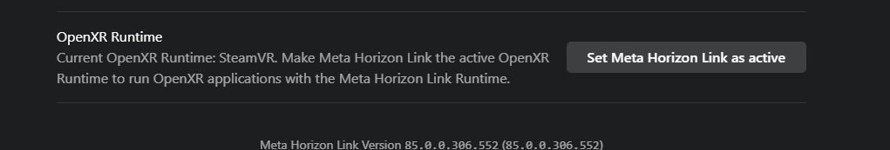


Ok on est bon niveau du setup.

Mais comme je dois vous monter des interfaces du casques...
Il me faut un outil pour voir l ecran du casauqe...

Il y a SCRCPY 
https://github.com/Genymobile/scrcpy/releases/tag/v4.0
Que vous pouvez deja telecharget et installer sur votre odinateur

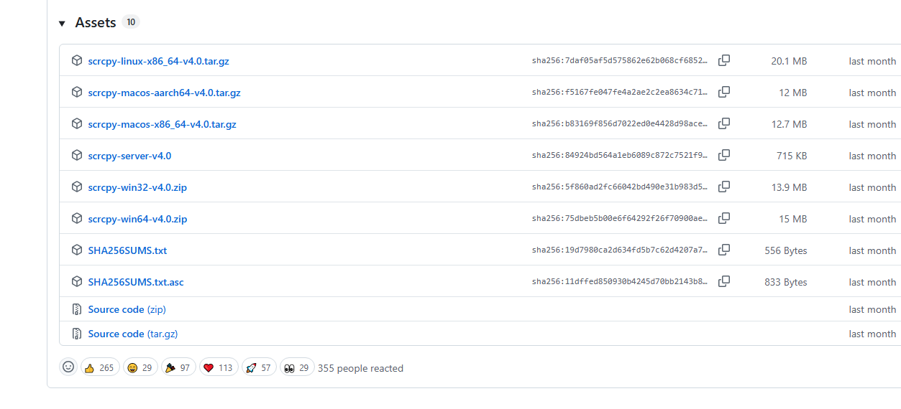

Je le dezzip generalement dans un fichier que j appelle exe a la racine
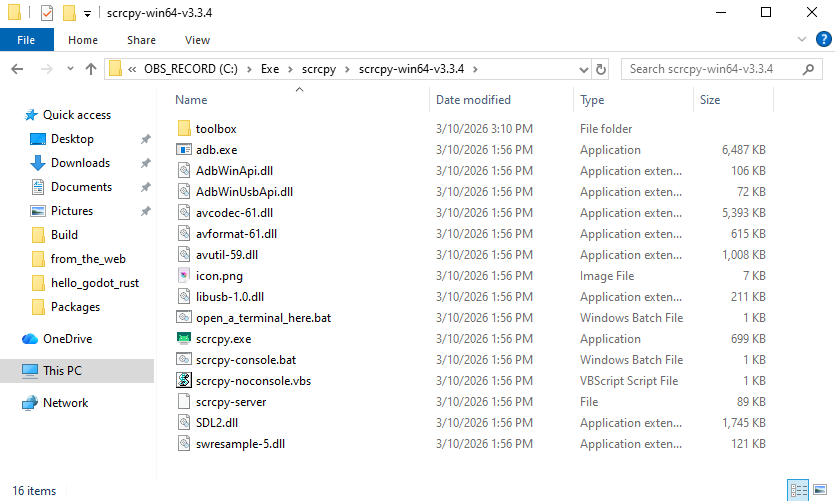

Sa vous permettra de faire des operatoins sur votre casques et d avoir al dernier version de ADB Android Debug Bridge pour monitorer votre casque voir gerer une flotte si vous avez un peu coder en python.
( Voir  https://github.com/EloiStree/2025_01_12_pyhton_build_run_apk_broadcaster.git )


Cela fait 2 ans que meta nous a casser notre SCRCPY.
Mais apparement le mois dernier cela a ete fixer ;)
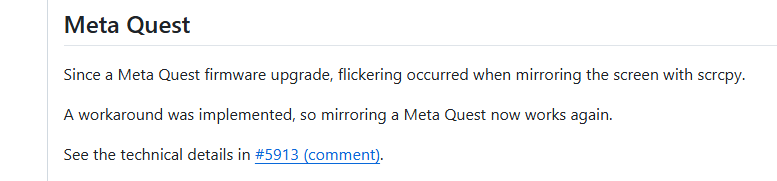
https://github.com/Genymobile/scrcpy/issues/5913#issuecomment-3677889916   
https://github.com/Genymobile/scrcpy/releases/tag/v4.0   


Verifier que le casque est brancher et que il est authorizer
Qu il n y a que un android brancher sur le pc
Puis cliquer ici
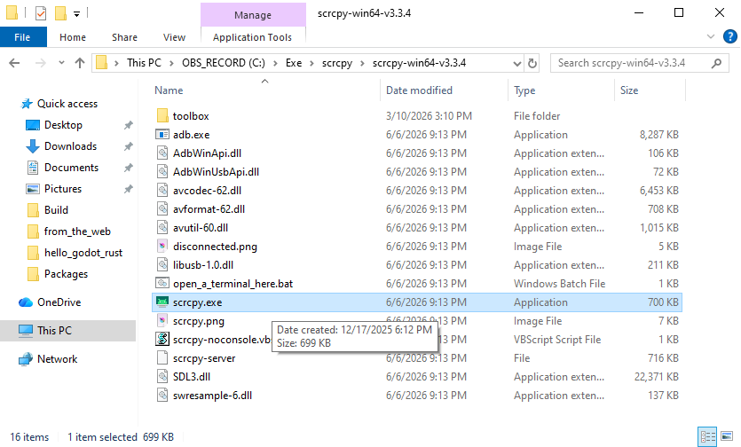
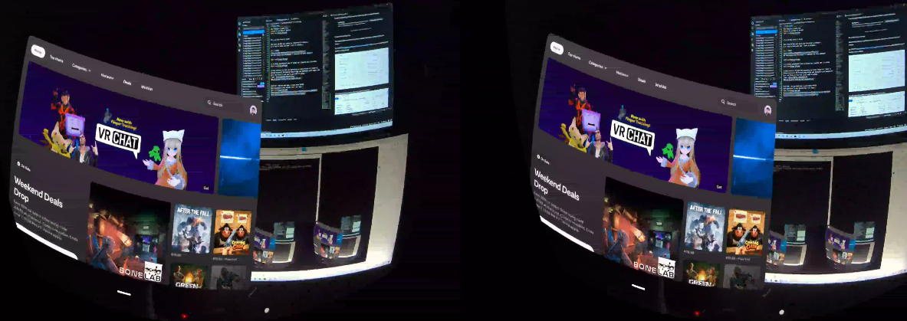
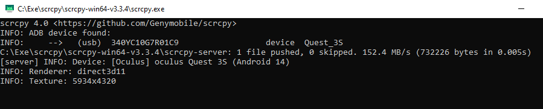

Bon la resolution et le frame rate cree de la latence...

Aller a coter de scrcpy.exe et dans le terminal clonons ce project.
```
git clone https://github.com/EloiStree/2025_01_12_pyhton_build_run_apk_broadcaster.git toolbox
```


Cela nous donera de quoi regarder en plus base resolution notre lentille de gauche
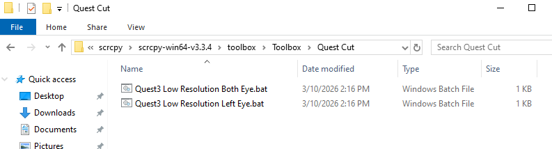

Bon apres factory reset la resolution du Quest 3S est pas le meme que la fois passer.
```
scrcpy.exe --video-source=display --audio-source=output --no-audio --orientation=0 --max-size 512 
```
INFO: Texture: 5934x4320

Si on veut voir la camera d ailleur
```
scrcpy --list-cameras   
scrcpy --list-camera-sizes    
```
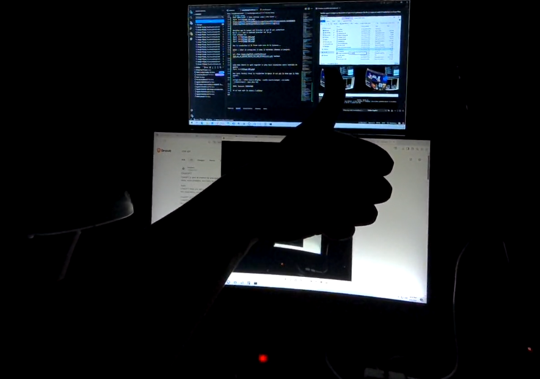
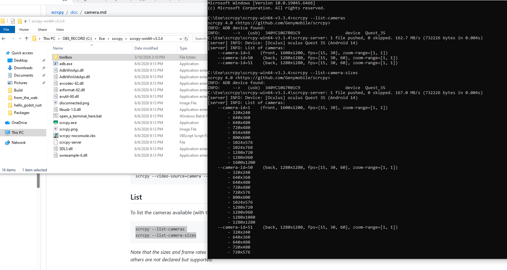  


En gros SCRCPY quand  cest pas casser par Meta.
C est trop genial😘


-----

Bon screen copy cest bien pour les nerds.

Mais il y a plus simple a installer sur vos machine

C est Meta Developer Hub

[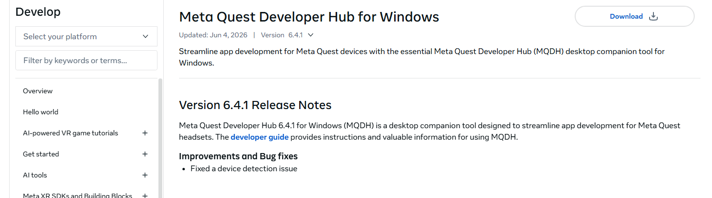](https://developers.meta.com/horizon/downloads/package/oculus-developer-hub-win/
)
https://developers.meta.com/horizon/downloads/package/oculus-developer-hub-win/

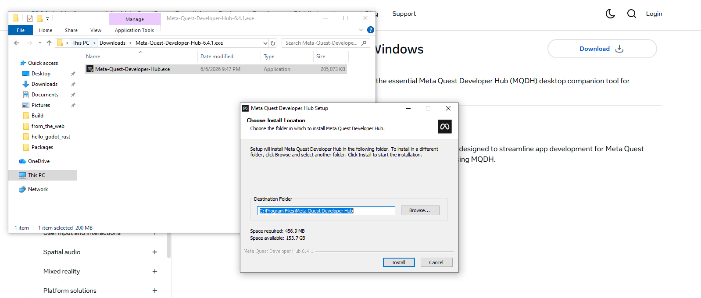

