Listons les outils ou vidéos que j'ai faits autour d'Unity et de la XR que vous pourriez utiliser si vous avez le temps.

MRTK : https://www.youtube.com/watch?v=LKohEluBk4k

XRTK : https://www.youtube.com/watch?v=eDicfcAgJB4

VRTK : https://www.youtube.com/watch?v=Hm55CR_Ubjc

VRTK 2017
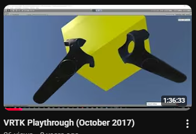
https://www.youtube.com/watch?v=MbXvuMTMEiU&t=568s

Oculus DK1, ça c'est du vieux :

https://www.youtube.com/watch?v=uuMUvlcDZxI

Énoncé d'exercice : angles et calculs locaux

https://www.youtube.com/watch?v=5ZJykUiELlg&pp=0gcJCSgLAYcqIYzv

Color Grayboxing
https://www.youtube.com/watch?v=wsBQlPwDZCA

Utiliser HDMI MiraBox dans Quest comme webcam

https://www.youtube.com/watch?v=bUa1vpEWpWw

Webcam et couleurs sur Quest

https://www.youtube.com/watch?v=mWer5XsM5sE

Webcam et Shader

https://www.youtube.com/watch?v=JnZOoryLwAI

Créer un OVNI qui bouge

https://www.youtube.com/watch?v=feUcacmKM-g

Travailler avec Shadow Tech et Steam VR

https://www.youtube.com/watch?v=yn5wTQ1f0Js

SCRCPY expliqué à ma mère

https://www.youtube.com/watch?v=YNdA74A-xc4&pp=0gcJCSgLAYcqIYzv

NTP pour le jeu en réseau

https://www.youtube.com/watch?v=lwtysm2z7bQ&pp=0gcJCSgLAYcqIYzv

Outer Wild

https://www.youtube.com/watch?v=Jgyxem5TKHw

https://www.youtube.com/watch?v=1rozpH0KadY&t=5s

Installer sur plusieurs Quest avec ADB et Python

https://i.ytimg.com/an_webp/koS1i9-CDL0/mqdefault_6s.webp?du=3000&sqp=CKeZkNEG&rs=AOn4CLDLn0CskMFuONSG7MST01c34ME_ww

Faire une appli 2D sur le Quest avec Unity

https://www.youtube.com/watch?v=OGyGTDQyv0c&t=8s
https://www.youtube.com/watch?v=1qHvjcAp1Ns&t=97s

Job System pour 12 000 joueurs sur un écran

https://www.youtube.com/watch?v=ZS4wBvms3CI

https://www.youtube.com/watch?v=bQcMWHdNHaQ

Triangulation en VR

https://www.youtube.com/watch?v=0k1kqoNi4UM

AR sur de grands espaces : Chill Boat

https://www.youtube.com/watch?v=shXihNXBBwg&t=159s
https://www.youtube.com/watch?v=MaX7Okfbt4E
https://www.youtube.com/watch?v=JOoh9xST1ew

De Open Brush à Unity3D

https://www.youtube.com/watch?v=Hmv0n9i4Rus&t=296s&pp=0gcJCSgLAYcqIYzv

Lerp et interpolation en VR ?

https://www.youtube.com/watch?v=XVb8mQiGJWI

Hacker un jeu Unity pour le rendre jouable en VR

https://www.youtube.com/watch?v=OOBxpljwhBg&t=390s

Mirror multijoueur et drone

https://www.youtube.com/watch?v=L_VJgbrHmzw

Motion Tracking en VR

https://www.youtube.com/watch?v=RZMME7HcI88

Caméra et vision infrarouge avec le Lynx

https://www.youtube.com/watch?v=PTgBxZ3PMF4&t=104s

Comment extraire des APK du store pour les joueurs sur le Quest 3

Accès à la caméra du Quest par ADB SCRCPY

https://www.youtube.com/watch?v=5PAxE4_s80E

Compute Shader + CPU + Mémoire Ram : quand un jeu t'oblige à optimiser

https://www.youtube.com/watch?v=pVxhmuf2IeA

Envoyer une image sur le réseau entre un PC et le Quest : File/UDP/Websocket/HTTP ?

https://www.youtube.com/watch?v=8ttTtDwSo_0

Si vous voulez faire du QA testing en XR pour une Xbox, comment hacker les inputs ?

https://www.youtube.com/watch?v=cKlV_1cfsJc&t=3162s

KISS : faire un jeu d'échecs en VR avec Mirror

https://www.youtube.com/watch?v=NCeAVAVr2v4&t=102s

Jeu en caméra couleur avec le Quest 2 Pro il y a 3 ans

https://www.youtube.com/watch?v=4fyJuxyemjM&t=19s

Collisions en VR

https://www.youtube.com/watch?v=_75NvDyEebw&t=1535s

Input en VR ?

https://www.youtube.com/watch?v=oehcYHrCtDE&t=45s

Faire une araignée qui te suit en VR

https://www.youtube.com/watch?v=fw4JoB9bUTA&t=2s

Installer un projet VR avec le Quest

https://www.youtube.com/watch?v=LcTtWlOoKAs&t=6981s

Démo de Magic Door

https://www.youtube.com/watch?v=B_iP8ApxYOg

State machine pour de la performance avec Job System ?

https://www.youtube.com/watch?v=zomgQslz0jA

VR Imposteur avec Job System

https://www.youtube.com/watch?v=gT3I8qI2y4E&t=1006s

Collisions pour beaucoup de balles qui vont super vite

https://www.youtube.com/watch?v=aSQFWhV5ur8

Faire une Jam VR en 3 heures ?

https://www.youtube.com/watch?v=YkGAWxjKQFQ

Des maths et un thérémine

https://www.youtube.com/watch?v=aHdrMV5jCvU

Créer un package pour le manager à l'époque de sa sortie

https://www.youtube.com/watch?v=t4G4xLq3kn8&t=8106s

Magic Door 24 Démo

https://www.youtube.com/watch?v=slwl9U3trmU&t=4s  
https://www.youtube.com/watch?v=KD47s4uWAIw&t=52s
https://www.youtube.com/watch?v=iQO_JNpipHg&t=133s
https://www.youtube.com/watch?v=9kgcZwMtF6g

Peut-on faire des previews 3D pour Cardboard depuis Unity ?

https://www.youtube.com/watch?v=ArzwgYzkZx8

Faire un package Unity en tant qu'artiste

https://www.youtube.com/watch?v=vgIK5L8dNFc&t=34s

Kapout Commander and Pinching tool

https://www.youtube.com/watch?v=ejz38f-x8EI&t=39s
https://www.youtube.com/watch?v=KBKiH1f2BB4&t=119s

Les mains du Quest et leur ID/Nom

https://www.youtube.com/watch?v=8TpVIcu-njg&t=11s 

https://www.youtube.com/watch?v=LIgWpyN51zQ

Un mois de ma vie à essayer de streamer de l'image VR avec des maths

https://www.youtube.com/watch?v=vj_kmeN4lJo&t=133s

Un des meilleurs jeux VR que j'ai créés

https://www.youtube.com/watch?v=9L6osH4hdYM

Exercice sur le Unity Package Manager

https://www.youtube.com/watch?v=vtNuQn6kS28&t=2472s
https://www.youtube.com/watch?v=nA7rfKUSrQE&t=1162s

Conférence sur la VR et ses abstractions

Git et Package facilitaires pour faire des packages

https://www.youtube.com/watch?v=ar4mU76_iiQ&t=890s
https://www.youtube.com/watch?v=s0tF1msmufU&t=5s

Faire un jeu de katana, aurait-il du sens ?

https://www.youtube.com/watch?v=YYIi6cqMdJA&t=187s

Parlons VR en 2024

https://youtu.be/YaORT34DxpI?t=4

Topic sur l'enregistrement de la caméra du casque en temps réel pour builder une vidéo plus tard avec une bonne qualité

https://youtu.be/5pEQf3I-bDw

Une application de tennis de table a-t-elle du sens ?

https://www.youtube.com/watch?v=l8MbMTar8kk&t=366s
https://www.youtube.com/watch?v=BDvlBkH4IvE&t=8s
https://www.youtube.com/watch?v=E5P4VI8e9m0

30 Ans ;)

https://www.youtube.com/watch?v=oqT90IVBvFI

Faire un jeu en MQTT avec le Quest ?

https://www.youtube.com/watch?v=QkhvLpKwgIk

Peut-on utiliser les manettes du Quest pour mesurer des objets dans la vraie vie ?

https://www.youtube.com/watch?v=3ca4e7z1bt0
https://www.youtube.com/watch?v=RWRs5e9ihT8&t=533s

Peut-on utiliser le Quest 123 dehors ?

https://www.youtube.com/watch?v=SplOVO-YYJU

C'est quoi l'infrarouge et comment ça marche dans le Quest 2 ?

https://www.youtube.com/watch?v=jzVMX8gSnaI&t=90s&pp=0gcJCSgLAYcqIYzv
https://www.youtube.com/watch?v=6giMjr7EcXE

https://www.youtube.com/watch?v=zGPvU7xLhIQ&t=575s&pp=0gcJCSgLAYcqIYzv
https://www.youtube.com/watch?v=UOvhGFQjs8k&t=794s

Le WebXR, c'est quoi et ça donne quoi ?

https://www.youtube.com/watch?v=lfu0QF8CRbo&t=1867s

Peut-on mesurer un bâtiment en marchant dedans avec le Quest ?

https://www.youtube.com/watch?v=_dh7jFIPwp0
https://www.youtube.com/watch?v=TVcORzb03Js&pp=0gcJCSgLAYcqIYzv 

Comment détecter le reset du Quest pour y associer une action

https://www.youtube.com/watch?v=ZbQbgCmyK5Q

Virtual Desktop sur Quest

https://www.youtube.com/watch?v=FLVUQGdef-s

Éditer une scène en temps réel avec Steam VR et ALVR

https://youtu.be/PD_MobYv7-o

Ouvrir des applis WebXR depuis Unity
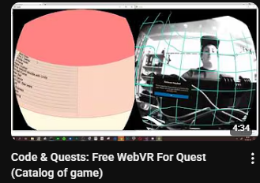
https://www.youtube.com/watch?v=fFzKA55dmYI

Votre gestionnaire de flotte avec ADB
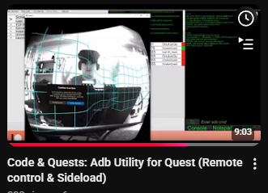
https://www.youtube.com/watch?v=TJqpjwhUBKI&t=388s

Peut-on jouer sur un terrain de basket-ball ?
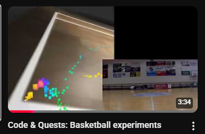
https://www.youtube.com/watch?v=1gzYlLiG0jg&t=30s

Peut-on permettre de jouer dans le noir avec deux ou trois LEDs infrarouges dans la pièce ?
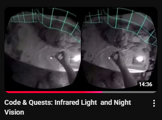
https://www.youtube.com/watch?v=b91o9Sp-jlU&t=569s

Permettre de jouer à un jeu qui n'est jouable que si vous avez le vrai matériel
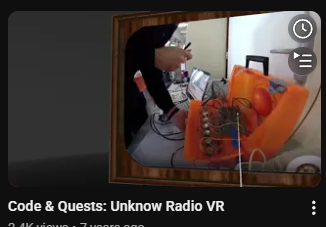
https://www.youtube.com/watch?v=Ni522aDeaOY

Mini jam d'une heure
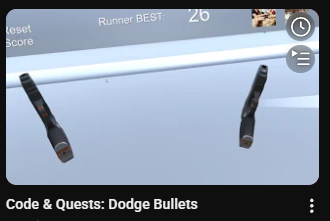
https://www.youtube.com/watch?v=oii0aaFOmEc

Ça donne quoi le drift si on joue dehors sur un terrain de mini-foot ?
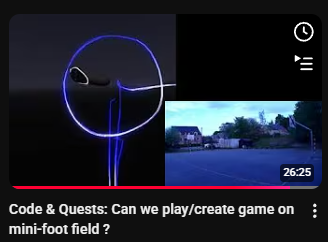
https://www.youtube.com/watch?v=UfsVeIiBXqs&t=1427s
https://www.youtube.com/watch?v=xWpWmEXi5mk&t=232s
https://www.youtube.com/watch?v=wHDAxiVceM0

Ça donne quoi le scan d'une maison avec Open Brush ?
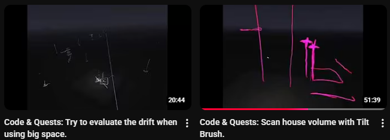
https://www.youtube.com/watch?v=wHDAxiVceM0
https://www.youtube.com/watch?v=KhFASODZru8&t=1804s

Field of view sur le Hololens
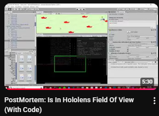
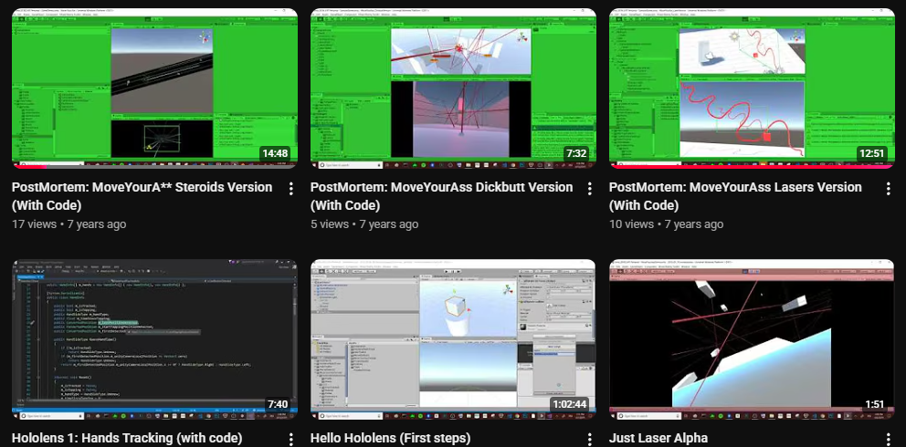
Field of view : https://www.youtube.com/watch?v=kRrytDc6AcU
Move your asteroid : https://www.youtube.com/watch?v=DIvXZGihL08&t=114s
Laser : https://www.youtube.com/watch?v=ToW2IGg15PQ
https://www.youtube.com/watch?v=HSWmp-VbqIg

Comment on écoute avec les mains sur le Hololens
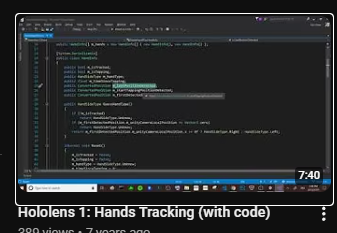
https://www.youtube.com/watch?v=2TUX-qeiJHw
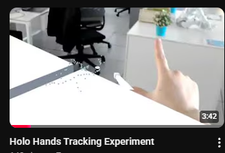
https://www.youtube.com/watch?v=tH6H52tBWww&t=1s&pp=0gcJCSgLAYcqIYzv

Premiers pas sur Hololens : comment installer
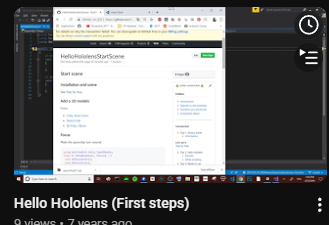
https://www.youtube.com/watch?v=_hQDM1R0QOs

Un package de laser pour des jeux sur Hololens ou en VR, et pour rester viable avec le field of view du Hololens
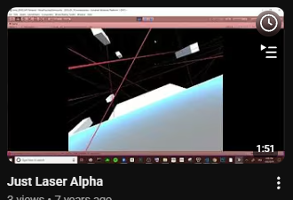
https://www.youtube.com/watch?v=u1uQqAnRjjg

On peut bouger en VR ;) Si vous avez un backpack et un Windows Headset (avant les Quest)
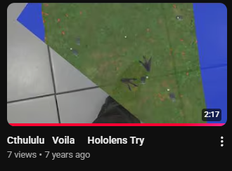
https://www.youtube.com/watch?v=azRvpoHAVZ0

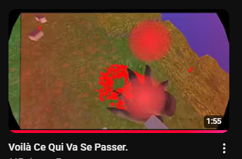
https://www.youtube.com/watch?v=NK_L5sAL07Y

Du passthrough ? en 2018
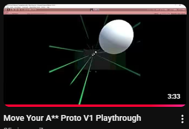
https://www.youtube.com/watch?v=asjYwOx-Ybc&pp=0gcJCSgLAYcqIYzv

Technique de baking et de pooling utilisant une animation pour la VR (astéroïdes et cylon)
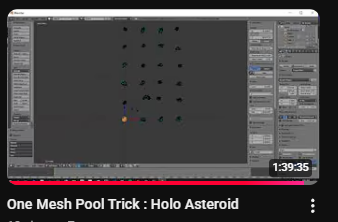
https://www.youtube.com/watch?v=BCLsgSMQo10&t=5733s

Essayons d'exporter le field of view d'un casque ou d'un Hololens
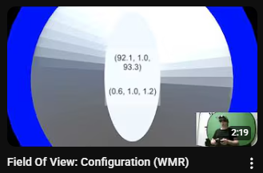
https://www.youtube.com/watch?v=3BtYJSlzYOU
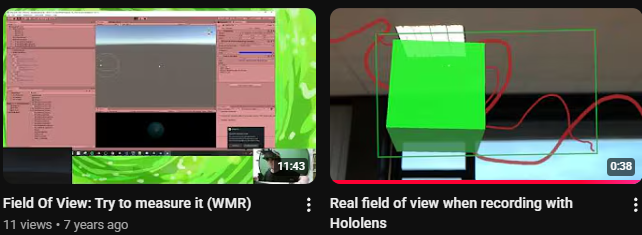
https://www.youtube.com/watch?v=xG-sN3kfKL4
https://www.youtube.com/watch?v=Nzbpakg8K7Q

Créer une application UWP pour le Hololens
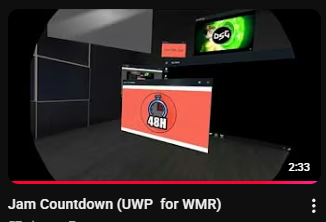
https://www.youtube.com/watch?v=1-asYqFYZmE

Utiliser un HC06 sur Android et PC pour contrôler ce qui vous entoure en VR ?
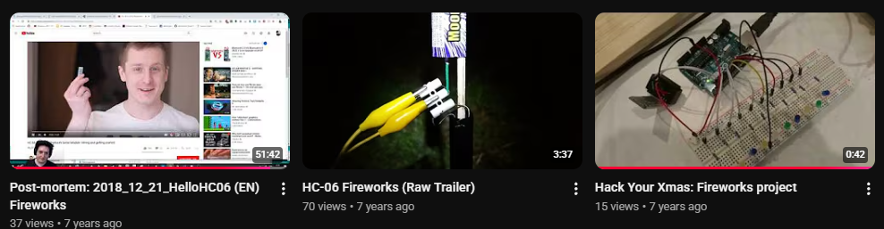
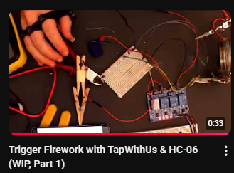
https://www.youtube.com/watch?v=LpK_XaDKtxs&t=2886s
https://www.youtube.com/watch?v=oDRuQUy8J84
https://www.youtube.com/watch?v=8gy29NxM48U
https://www.youtube.com/watch?v=vKi7ApsxXcY

VR et Zed Mini : pour voir ce que donnerait une caméra d'accès
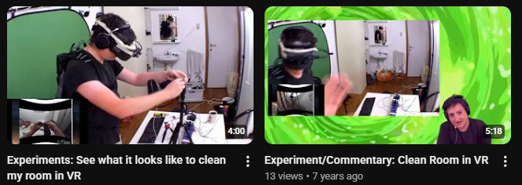
https://www.youtube.com/watch?v=iAGkNTB85CM
https://www.youtube.com/watch?v=k--XM4TcIIc

Faire un jeu en une heure ?
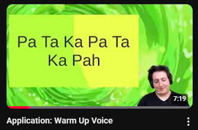
https://www.youtube.com/watch?v=q0xBfWwefX8&t=58s

Faire un jeu en 24h
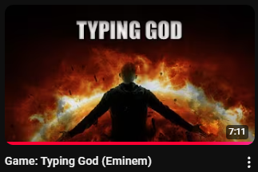
https://www.youtube.com/watch?v=DGJ12SL3gGk

Utiliser Vuforia pour tracker des cartes de jeux
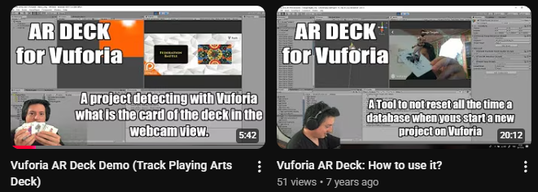
https://www.youtube.com/watch?v=gS-9Ad6HTI8&t=1s
https://www.youtube.com/watch?v=r3zYJ7fnqFw

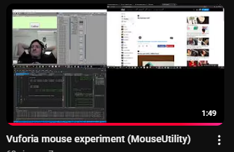
https://www.youtube.com/watch?v=xmcsUvd2MYQ

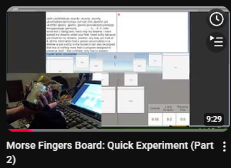
https://www.youtube.com/watch?v=pp3ZlUJKHuk&t=74s

Réinventer le clavier pour la VR ?
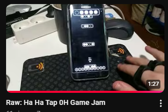
https://www.youtube.com/watch?v=V4cRMCnBdMU

Exercice de rotation avec un jeu de boxe
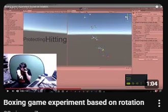
https://www.youtube.com/watch?v=TYyGNXcQ5wQ

C'est quoi la VR ?
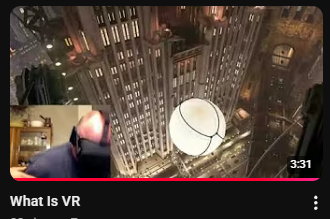
https://www.youtube.com/watch?v=wRCS2-AAyNM
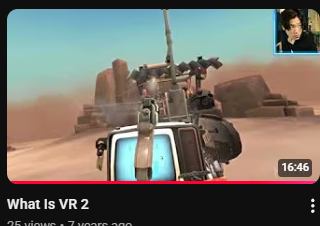
https://www.youtube.com/watch?v=8rVnkWbLnk8

Storytelling en 360° et heatmap via Youtube
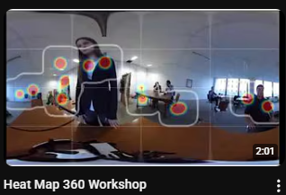

Zed Mini
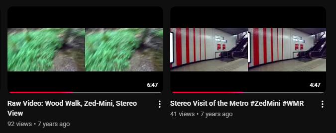
https://www.youtube.com/watch?v=s2drhv-jPUg&t=135s
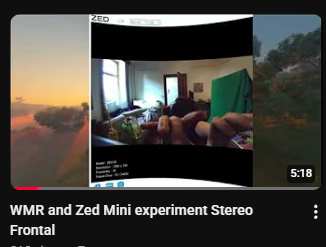
https://www.youtube.com/watch?v=KIV9x0QXUZU&t=10s

ThetaS Caméra 360°
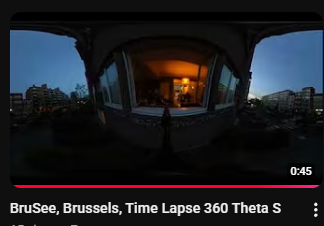
https://www.youtube.com/watch?v=Et7PEFhJlUw

Inside VR de Thomas V.
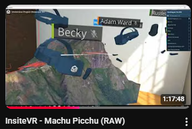
https://www.youtube.com/watch?v=r4tmKcERPRw&t=1892s

Scan VR avec une Zed Mini à vélo
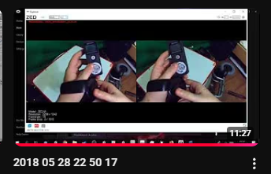
https://www.youtube.com/watch?v=3NIql6pNtmY&pp=0gcJCSgLAYcqIYzv
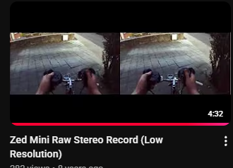
https://www.youtube.com/watch?v=oGTlwqqOtJg

TPS dans la vraie vie ?
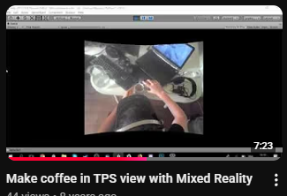
https://www.youtube.com/watch?v=mOzPmmK3tg8&t=227s
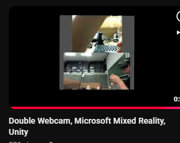
https://www.youtube.com/watch?v=14nTYZ28POE

Scan d'objets avec Open Brush
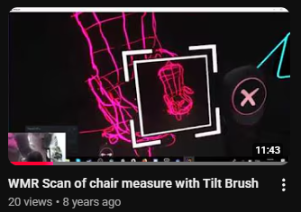
https://www.youtube.com/watch?v=ZewJ77ubl8o&t=113s
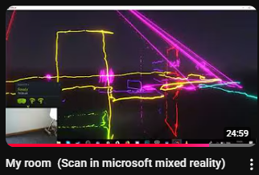
https://www.youtube.com/watch?v=I_NwgP6cWMI&t=1221s

Blending Jam
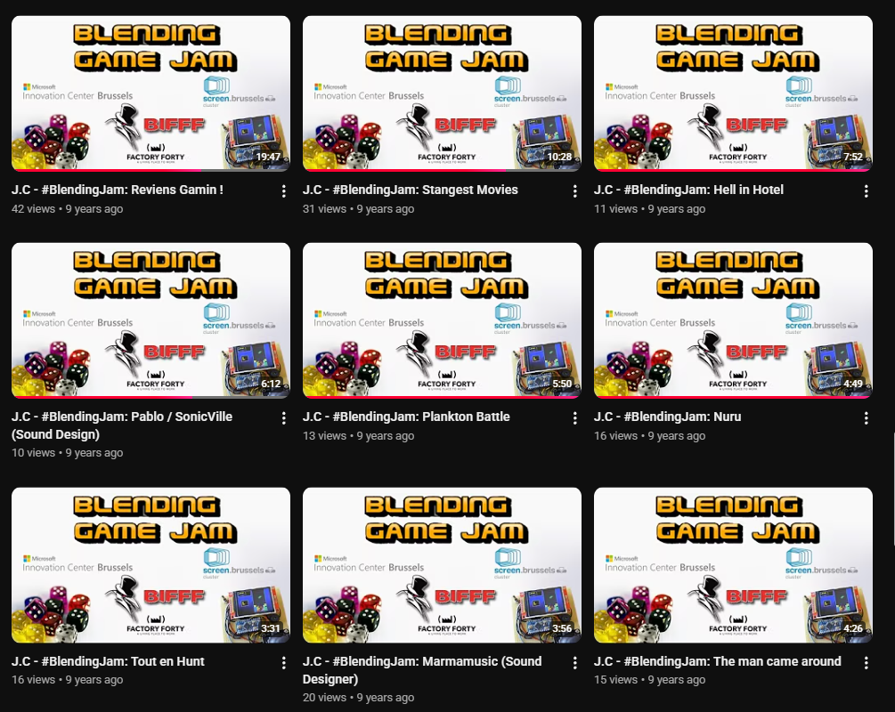
https://www.youtube.com/watch?v=x9vJrjDuFF4&t=814s

UpWays
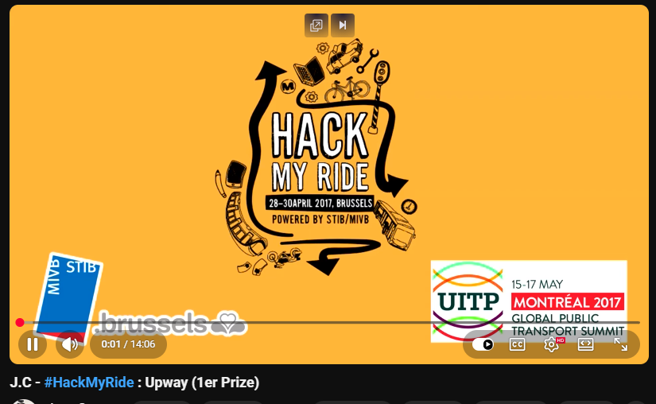
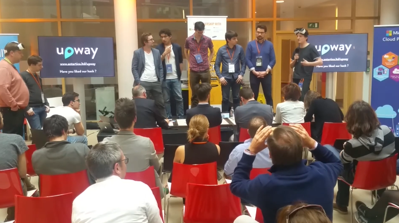
https://youtu.be/Rz9JXtZcbA4

Raphael Painting Jam
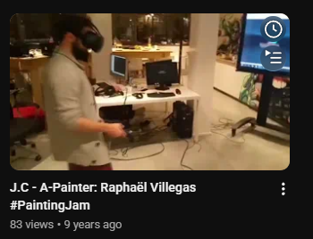
https://www.youtube.com/watch?v=vpBRFjyqSRA&pp=0gcJCSgLAYcqIYzv

VR Humain and Painting
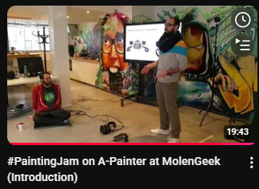
https://www.youtube.com/watch?v=YT465iIMdhI

Architecture et VR

https://www.youtube.com/watch?v=n0hcZxsWR3Y&pp=0gcJCSgLAYcqIYzv

Travailler avec des hôpitaux

https://www.youtube.com/watch?v=nU0RQAOy0yc

BMC in VR

https://www.youtube.com/watch?v=YrR-b8-PHPg

La KISS your teacher game jam 2016

https://youtu.be/qrgzx00RCBI

Thomas Furness et la VR

https://www.youtube.com/watch?v=MhpxXPr4SY8

Storytelling 360°, conférence sur le sujet

https://www.youtube.com/watch?v=NRQOaW1rAKM

Expérimentation d'un petit concert pour le fun en vidéo 360°

https://www.youtube.com/watch?v=CWXVgrm56Gs

Voir à travers ses mains avec des webcams durant la Citizen

https://youtu.be/bmcbHZuoK4g?t=512

Démo sur Meta Developer Hub App

https://www.youtube.com/@LearnByPlayingInXR/videos

https://www.youtube.com/@LearnByPlayingInXR/shorts

---------------

# Eloi Stree

Ça donnerait quoi de voir avec les odeurs ?

https://www.youtube.com/watch?v=1pqCA1mT_-E

3h pour faire un jeu ?

https://www.youtube.com/watch?v=YbL5CYoa91A&pp=0gcJCSgLAYcqIYzv

Entre la performance de votre casque

https://www.youtube.com/watch?v=lmMwo4egIPU

Scan pour la VR

https://www.youtube.com/watch?v=csfDo5HBN0U

D'un mesh au voxel dans Unity ?

https://www.youtube.com/watch?v=arIoK70azyo

https://www.youtube.com/watch?v=NmToclELF8k
https://www.youtube.com/watch?v=tb78xYbgx6s

Fuck NDA, je peux pas parler de ce jeu.

https://www.youtube.com/watch?v=3JSLL873Nz8

Jeux à travers des webcams ?

https://www.youtube.com/watch?v=1j5-ZSKc6w4

Stéréo view to video ?

https://www.youtube.com/watch?v=Uk7NJDqp5G8

Appli 360° pour visiter un événement

https://www.youtube.com/watch?v=Bt-0Uup92ko

One Mesh concept pour le pooling dans Unity

https://www.youtube.com/watch?v=f21l7T1aFu0&pp=0gcJCSgLAYcqIYzv

Track a bug with Vuforia

https://www.youtube.com/watch?v=-9FdMYp-B7s

AR et VR avec Vuforia

https://www.youtube.com/watch?v=VqgqSFApH-Q

Vidéo 360° pour un jeu sur Cardboard

https://www.youtube.com/watch?v=8RHyhq3Bu1M

Brutal Wheel Char

https://www.youtube.com/watch?v=uePqTm80t2Y

Jeu pour briser le mur entre celui qui joue et ceux qui regardent

https://www.youtube.com/watch?v=yOjJ4AjDKMM

Un jeu chill que j'ai créé entre la Kinect et le Gear VR

https://www.youtube.com/watch?v=U_H4T1sMYL4

Gerbatron 2000 but fun : Jam de 3 semaines

https://www.youtube.com/watch?v=kwSWCrkFUd4

Un téléphone comme contrôleur ?

https://www.youtube.com/watch?v=oVppA1LyYdw

Un jeu des 7 erreurs pour chaise roulante

https://www.youtube.com/watch?v=9sq2fovSy6c

Simuler une chaise roulante en VR

https://www.youtube.com/watch?v=L-Ff_epavlM&pp=0gcJCSgLAYcqIYzv

Pooling

https://www.youtube.com/watch?v=BPbTssjNvzs

Un jeu en VR sur DK1 avec Java ?

https://www.youtube.com/watch?v=e4eUUVXhwYM

Des rotations partout

https://www.youtube.com/watch?v=7uiYzV23XPs

Du ralenti pour les clubs de sport ?

https://www.youtube.com/watch?v=r84nEwzDgx4

Visite 360° facile ;)

https://www.youtube.com/watch?v=q3hdAgb6exs
https://www.youtube.com/watch?v=YRhCRERks_g
https://www.youtube.com/watch?v=HjOcdjjVrwQ

Ton projet c'est de la merde ;)

https://www.youtube.com/watch?v=Zp4iBEnoDro

My internship : Wolfenstein en VR avec la Kinect et le Oculus DK1

https://www.youtube.com/watch?v=zem8pyuyNas

Kiss your puppet

https://www.youtube.com/watch?v=nvMY04GPniE

