Let's list tool or video I did around Unity and XR that you could use if you have time.

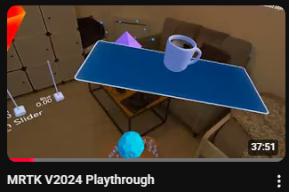
MRTK: https://www.youtube.com/watch?v=LKohEluBk4k
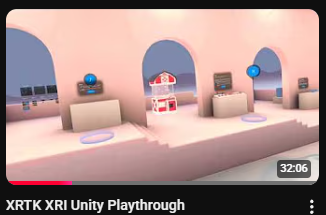
XRTK: https://www.youtube.com/watch?v=eDicfcAgJB4
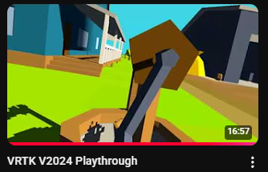
VRTK: https://www.youtube.com/watch?v=Hm55CR_Ubjc

Oculus DK1 ca c est du vieux:
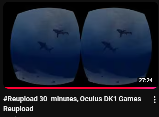
https://www.youtube.com/watch?v=uuMUvlcDZxI

Enoncer d exercice
 Angle et calcule local
 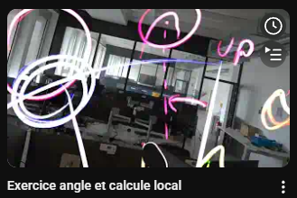
 https://www.youtube.com/watch?v=5ZJykUiELlg&pp=0gcJCSgLAYcqIYzv

 Color Grayboxing
 https://www.youtube.com/watch?v=wsBQlPwDZCA

 Utiliser HDMI MiraBox in Quest as webcam
 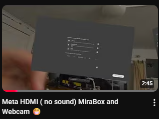
 https://www.youtube.com/watch?v=bUa1vpEWpWw

 Webcam et color Quest
 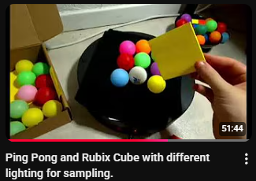
 https://www.youtube.com/watch?v=mWer5XsM5sE

 Webcam et Shader
 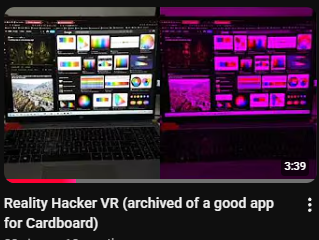
 https://www.youtube.com/watch?v=JnZOoryLwAI

 Create Moving OVNI
 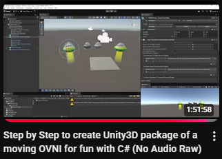
 https://www.youtube.com/watch?v=feUcacmKM-g

 Work with Shadow Tech and Steam VR
 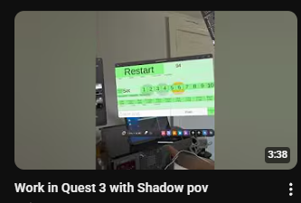
https://www.youtube.com/watch?v=yn5wTQ1f0Js

SCRCPY expliquer a ma mere
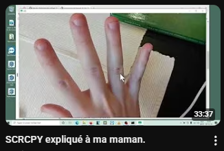
https://www.youtube.com/watch?v=YNdA74A-xc4&pp=0gcJCSgLAYcqIYzv

NTP pour le jeu en reseau
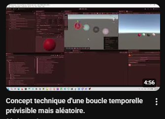
https://www.youtube.com/watch?v=lwtysm2z7bQ&pp=0gcJCSgLAYcqIYzv

Outter Wild
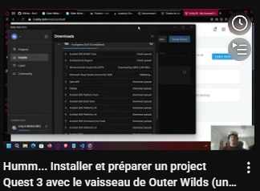
https://www.youtube.com/watch?v=Jgyxem5TKHw

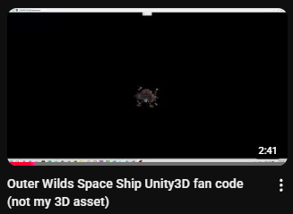
https://www.youtube.com/watch?v=1rozpH0KadY&t=5s

Installer sur plusieurs quest avec ADB et pytho
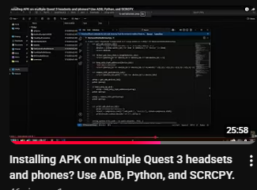
https://i.ytimg.com/an_webp/koS1i9-CDL0/mqdefault_6s.webp?du=3000&sqp=CKeZkNEG&rs=AOn4CLDLn0CskMFuONSG7MST01c34ME_ww

Make 2D app in the Quest with Unity
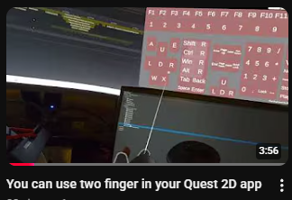
https://www.youtube.com/watch?v=OGyGTDQyv0c&t=8s
https://www.youtube.com/watch?v=1qHvjcAp1Ns&t=97s

Job system pour 12000 joueurs sur un ecran
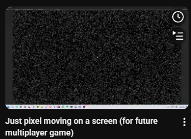
https://www.youtube.com/watch?v=ZS4wBvms3CI

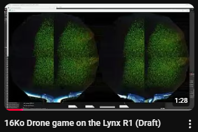

https://www.youtube.com/watch?v=bQcMWHdNHaQ

Triangulation en VR
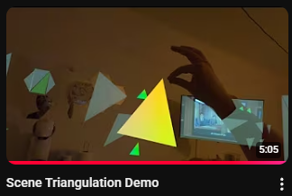
https://www.youtube.com/watch?v=0k1kqoNi4UM

AR sur de grand espace Chill Boat
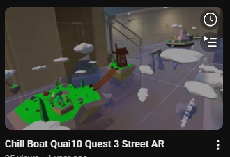
https://www.youtube.com/watch?v=shXihNXBBwg&t=159s
https://www.youtube.com/watch?v=MaX7Okfbt4E
https://www.youtube.com/watch?v=JOoh9xST1ew

DE Open Brush  a Unity3D
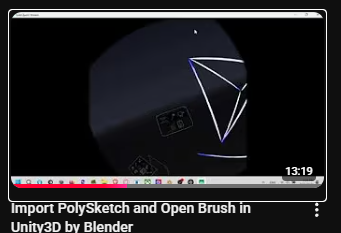
https://www.youtube.com/watch?v=Hmv0n9i4Rus&t=296s&pp=0gcJCSgLAYcqIYzv

Lerp et interpolation en VR ?
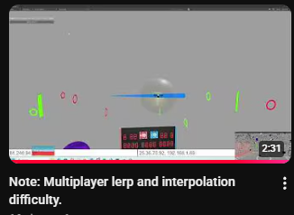
https://www.youtube.com/watch?v=XVb8mQiGJWI

Hacker un jeu Unity pour le rendre jouable en VR
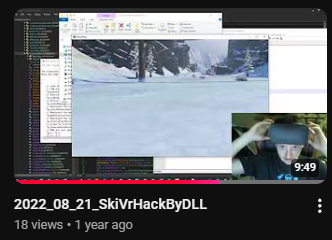
https://www.youtube.com/watch?v=OOBxpljwhBg&t=390s

Mirror multijouer et drone
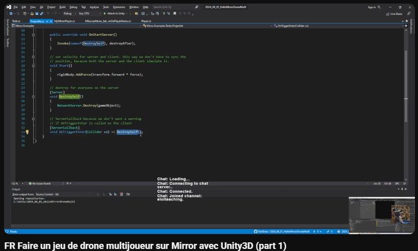
https://www.youtube.com/watch?v=L_VJgbrHmzw 

Motion Tracking en VR
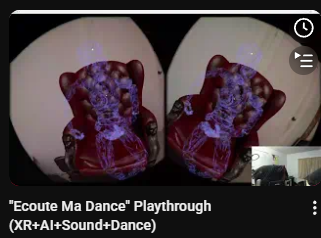

https://www.youtube.com/watch?v=RZMME7HcI88

Camera et Infrared vision avec le Lynx
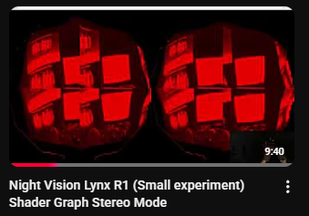
https://www.youtube.com/watch?v=PTgBxZ3PMF4&t=104s

Comment expraire des APK du stor epour les jouers sur le Quest3
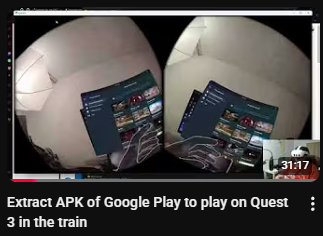

Access au camera du Quest par ADB SCR CPY
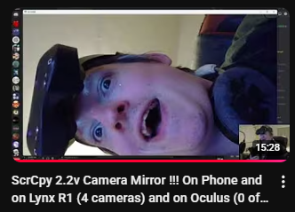
https://www.youtube.com/watch?v=5PAxE4_s80E

Compute Shader + CPU + Memory Ram
Quand un jeu t oblige a optimiser
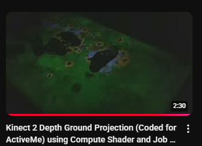
https://www.youtube.com/watch?v=pVxhmuf2IeA

Envoyer une image sur le reseau entre un pc et le Quest
File/UDP/Websocket/HTTp?
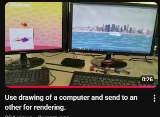
https://www.youtube.com/watch?v=8ttTtDwSo_0

Si vous voulez faire du QA testing en XR pour une XBOX
comment hacker les inputs
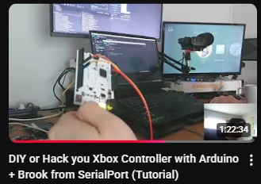
https://www.youtube.com/watch?v=cKlV_1cfsJc&t=3162s

KISS faire un jeu d echec en VR avec Mirror
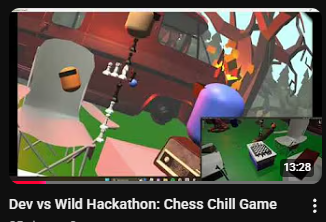
https://www.youtube.com/watch?v=NCeAVAVr2v4&t=102s

Jeu en camera couleur avec le Quest 2 Pro il y a 3 ans
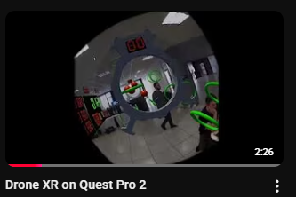
https://www.youtube.com/watch?v=4fyJuxyemjM&t=19s

Collision en VR
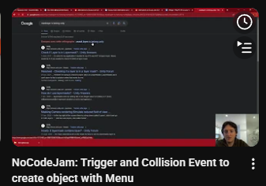
https://www.youtube.com/watch?v=_75NvDyEebw&t=1535s

Input en VR ?
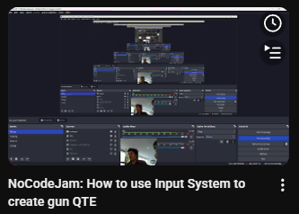
https://www.youtube.com/watch?v=oehcYHrCtDE&t=45s

Faire un araigner qui te suit en vr
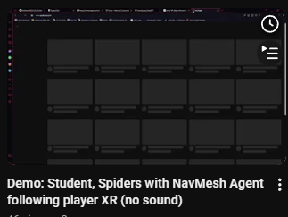
https://www.youtube.com/watch?v=fw4JoB9bUTA&t=2s

Installer un project VR avec le Quest
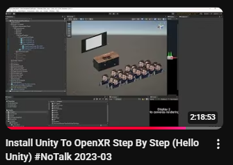
https://www.youtube.com/watch?v=LcTtWlOoKAs&t=6981s

Demo de magic door 
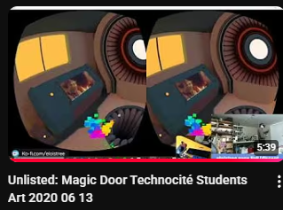
https://www.youtube.com/watch?v=B_iP8ApxYOg

State machine pour de la performance en Job System ?
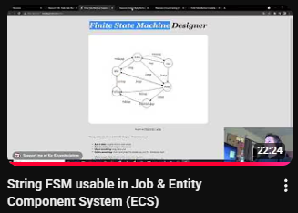
https://www.youtube.com/watch?v=zomgQslz0jA

VR Imposteur avec Job System:
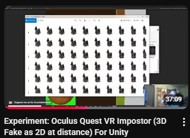
https://www.youtube.com/watch?v=gT3I8qI2y4E&t=1006s

Collision pour beaucoup de bullet qui vont super vite:
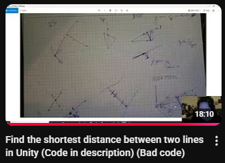
https://www.youtube.com/watch?v=aSQFWhV5ur8

Faire un Jam VR en 3 heures ?
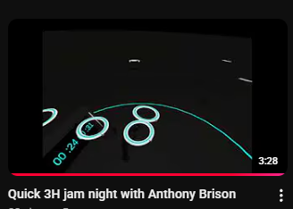
https://www.youtube.com/watch?v=YkGAWxjKQFQ

Des maths et une theramin
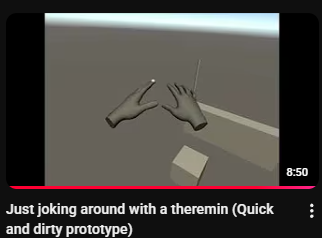
https://www.youtube.com/watch?v=aHdrMV5jCvU

Creer un package pour le manager a l epoque de sa sortie:
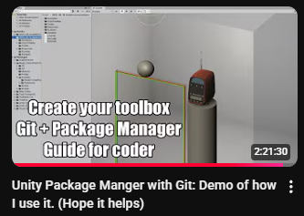
https://www.youtube.com/watch?v=t4G4xLq3kn8&t=8106s

Magic Door 24 Demo
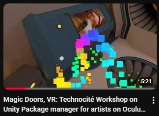
https://www.youtube.com/watch?v=slwl9U3trmU&t=4s  
https://www.youtube.com/watch?v=KD47s4uWAIw&t=52s
https://www.youtube.com/watch?v=iQO_JNpipHg&t=133s
https://www.youtube.com/watch?v=9kgcZwMtF6g

Peut on faire des previews 3D pour cardbaord depuis Unity ?

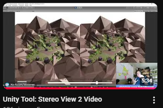
https://www.youtube.com/watch?v=ArzwgYzkZx8

Faire un Package Unity en tant que Artiste
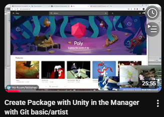
https://www.youtube.com/watch?v=vgIK5L8dNFc&t=34s

Kapout Commander and Pinching tool
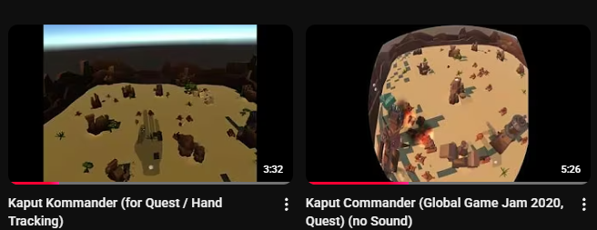
https://www.youtube.com/watch?v=ejz38f-x8EI&t=39s
https://www.youtube.com/watch?v=KBKiH1f2BB4&t=119s

Les mains du Quest et leur ID / Nom
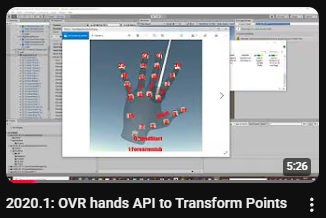
https://www.youtube.com/watch?v=8TpVIcu-njg&t=11s 

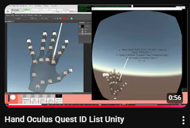
https://www.youtube.com/watch?v=LIgWpyN51zQ

Un mois de ma vie a essayer de stream de l image VR avec des maths:

https://www.youtube.com/watch?v=vj_kmeN4lJo&t=133s

Un des meilleurs jeu VR que j ai creer:

https://www.youtube.com/watch?v=9L6osH4hdYM

Exercice sur le Unity Package manager

https://www.youtube.com/watch?v=vtNuQn6kS28&t=2472s
https://www.youtube.com/watch?v=nA7rfKUSrQE&t=1162s

Conferance sur la VR et ses abstractions

Git et Package Facilitaire pour faire des packages.

https://www.youtube.com/watch?v=ar4mU76_iiQ&t=890s
https://www.youtube.com/watch?v=s0tF1msmufU&t=5s

Faire un jeu de Katana aurait il du sens;

https://www.youtube.com/watch?v=YYIi6cqMdJA&t=187s

Parlons VR etn 2024

https://youtu.be/YaORT34DxpI?t=4

Topic sur dur. enregistrer la camera du casque en temps reel pour builder une video plus tard avec un bonne qualiteee;

https://youtu.be/5pEQf3I-bDw

Une application de tennis de table a tel du sens ?

https://www.youtube.com/watch?v=l8MbMTar8kk&t=366s
https://www.youtube.com/watch?v=BDvlBkH4IvE&t=8s
https://www.youtube.com/watch?v=E5P4VI8e9m0

30 Ans ;)

https://www.youtube.com/watch?v=oqT90IVBvFI

Faire un jeu en MQTT avec le Quest ?

https://www.youtube.com/watch?v=QkhvLpKwgIk

Peut on utiliser les manettes du Quest pour measurer des objets dans la vrai vie?

https://www.youtube.com/watch?v=3ca4e7z1bt0
https://www.youtube.com/watch?v=RWRs5e9ihT8&t=533s

Peut on utiliser le Quest 123 dehors

https://www.youtube.com/watch?v=SplOVO-YYJU

C est quoi de l infrarouge et comment ca marche dans le Quest 2

https://www.youtube.com/watch?v=jzVMX8gSnaI&t=90s&pp=0gcJCSgLAYcqIYzv
https://www.youtube.com/watch?v=6giMjr7EcXE

https://www.youtube.com/watch?v=zGPvU7xLhIQ&t=575s&pp=0gcJCSgLAYcqIYzv
https://www.youtube.com/watch?v=UOvhGFQjs8k&t=794s

Le web XR c est quoi et ca donne quoi

https://www.youtube.com/watch?v=lfu0QF8CRbo&t=1867s

Peut on measurer un batiment en marchant dedans avec le Quest ?

https://www.youtube.com/watch?v=_dh7jFIPwp0
https://www.youtube.com/watch?v=TVcORzb03Js&pp=0gcJCSgLAYcqIYzv 

Comment detecter le Reset du Quest pour y associer une action

https://www.youtube.com/watch?v=ZbQbgCmyK5Q

Virtual Desktop on Quest

https://www.youtube.com/watch?v=FLVUQGdef-s

Editer une scene en temps reel avec Steam VR et ALVR

https://youtu.be/PD_MobYv7-o